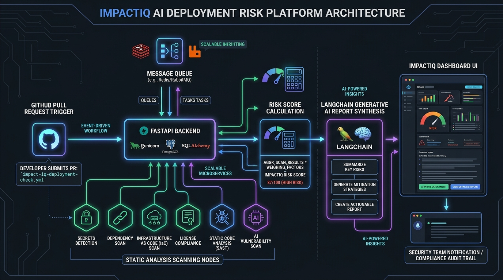
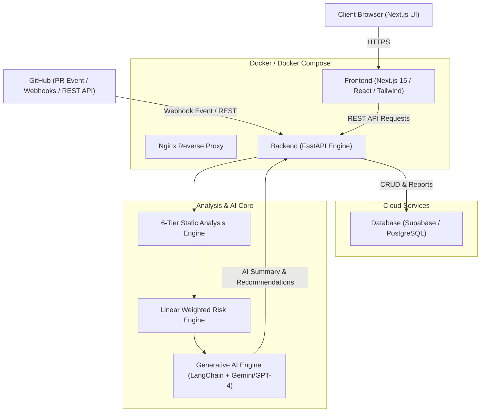
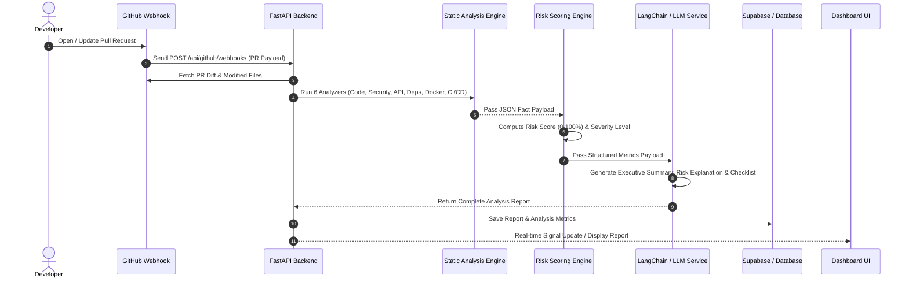

# ImpactIQ — System Architecture & Technical Specification

ImpactIQ is an AI-powered, cloud-native deployment risk analysis platform designed to automatically evaluate GitHub Pull Requests before release. It combines static analysis, security scanning, container/CI-CD validation, and Generative AI to provide automated risk scores and deployment insights.

---

## 1. High-Level System Architecture

The diagram below illustrates the end-to-end architecture and component interaction between the client browser, Next.js frontend, FastAPI backend, analysis engines, database, and external APIs.





---

## 2. End-to-End Analysis Pipeline

When a developer opens or updates a Pull Request on GitHub, ImpactIQ executes the following event-driven workflow:



---

## 3. Core Modules & Engine Breakdown

### 3.1 Static Analysis Engine (Deterministic Compute)
ImpactIQ isolates deterministic computation from Generative AI. The Static Engine executes 6 static checks:

| Analyzer | Responsibilities & Checks |
| :--- | :--- |
| **Code Analyzer** | Evaluates changed files, lines added/deleted, function modifications, and complexity. |
| **Dependency Analyzer** | Scans `package.json`, `requirements.txt`, version bumps, and package conflicts. |
| **Security Analyzer** | Detects hardcoded secrets, API tokens, sensitive file modifications, and auth logic edits. |
| **API Analyzer** | Detects endpoint additions, parameter changes, breaking REST API contract edits. |
| **Docker Analyzer** | Validates `Dockerfile` & `docker-compose.yml` for base images, root user usage, healthchecks, and exposed ports. |
| **CI/CD Analyzer** | Validates `.github/workflows/` YAML files for test execution, secrets usage, and deployment steps. |

### 3.2 Risk Scoring Engine
Calculates a weighted risk score ($0 - 100\%$) and maps it to a severity rating:

$$\text{Risk Score} = w_1 \cdot \text{CodeScore} + w_2 \cdot \text{SecurityScore} + w_3 \cdot \text{APIScore} + w_4 \cdot \text{DockerScore} + w_5 \cdot \text{CicdScore}$$

- **0% – 30%**: Low Risk (Deployment Ready)
- **31% – 60%**: Medium Risk (Caution Advised)
- **61% – 85%**: High Risk (Needs Review & Testing)
- **86% – 100%**: Critical Risk (Deployment Blocked)

### 3.3 Generative AI Engine
Consumes the deterministic JSON metrics from the static engines and generates human-readable insights using **LangChain** and **Google Gemini / OpenAI**:
- **Executive Summary**: 2-3 sentence release overview.
- **Risk Explanation**: Clear breakdown of why the score was assigned.
- **Deployment & Testing Recommendations**: Actionable unit, integration, and regression testing steps.
- **Deployment Checklist**: Automated safety verification steps before production merge.

---

## 4. Database Schema (Supabase / PostgreSQL)

The backend interacts with 6 core relational tables:

```
users (id, email, username, github_id, avatar_url)
  │
  ├── projects (id, name, repository_id, default_branch, module_flags)
  │     │
  │     ├── repositories (id, name, owner, full_name, language)
  │     ├── analyses (id, commit_sha, pr_number, status, risk_score, severity)
  │     └── reports (id, analysis_id, executive_summary, findings_json, recommendations)
  │
  └── integrations (id, provider, access_token, webhook_secret)
```

---

## 5. DevOps & Containerization

ImpactIQ is fully containerized using **Docker** and **Docker Compose**:

- **`backend/Dockerfile`**: Python 3.12 slim runtime with UTF-8 support and FastAPI server.
- **`frontend/Dockerfile`**: Node 18 Alpine runtime building production Next.js static asset bundles.
- **`docker-compose.yml`**: Orchestrates frontend, backend, and environment configuration.
- **`database/schema.sql`**: Idempotent PostgreSQL initialization script.

---

## 6. Technology Stack Summary

- **Frontend**: Next.js 15, React 19, TypeScript, Tailwind CSS, Lucide Icons, Radix UI
- **Backend**: FastAPI, Python 3.12, Pydantic v2, SQLAlchemy, JWT, HTTPX
- **Database**: Supabase, PostgreSQL 15, SQLite (Local Dev Fallback)
- **Generative AI**: LangChain, Google Gemini API / OpenAI GPT-4, Prompt Templates
- **DevOps**: Docker, Docker Compose, GitHub Actions, GitHub REST API & Webhooks
