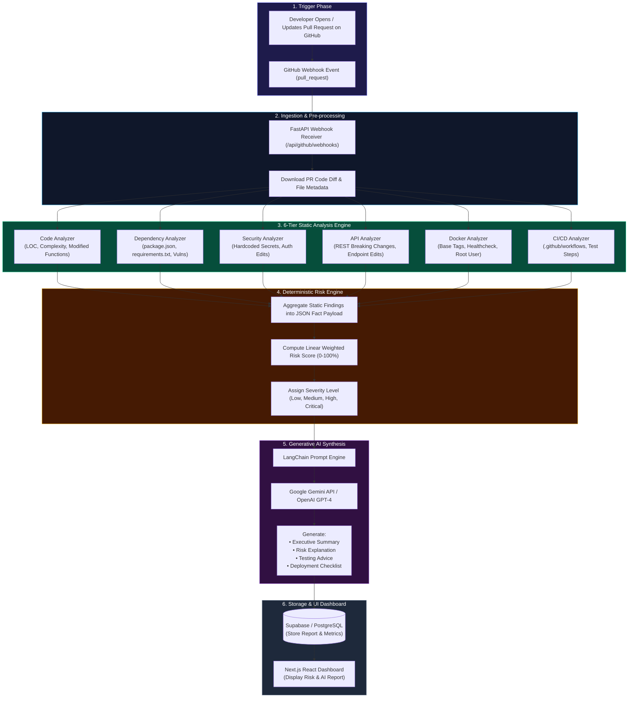
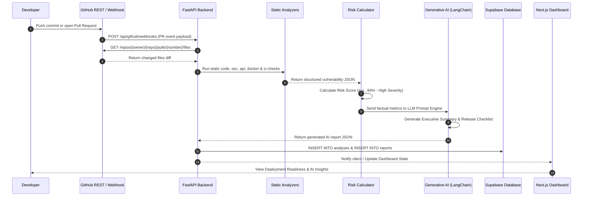
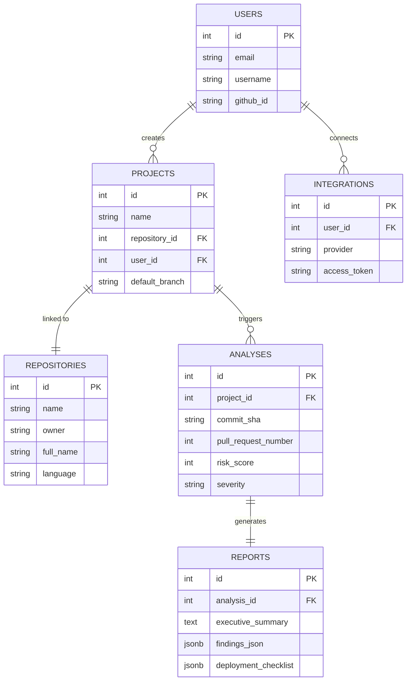

# ImpactIQ — Visual Architectural Flowcharts & Diagrams

This document contains visual diagrams, sequence flows, and system component maps for the ImpactIQ platform.

---

## 1. System Architecture Infographic

---

## 2. Complete End-to-End System Workflow

The diagram below shows the flow of data from GitHub Webhook triggers down to FastAPI execution, static analyzers, Risk calculation, Generative AI, and Dashboard persistence:

---

## 3. Pull Request Webhook Sequence Diagram

---

## 4. Database Entity-Relationship (ER) Diagram

